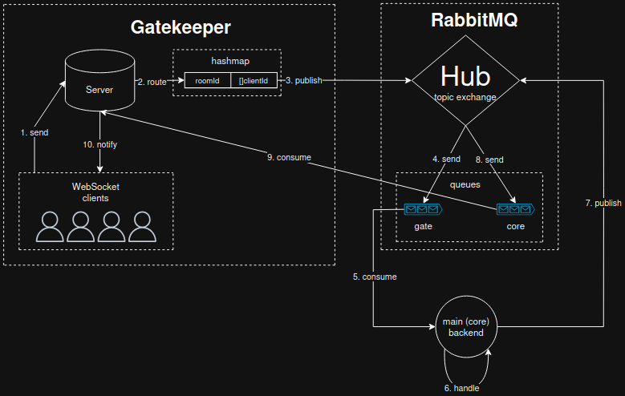

The main idea is to decouple core application logic from WebSocket connection 
management, enabling multiple modular instances to publish events to a central server.

Gatekeeper doesn't know who processes events and how, or whether anyone processes 
them at all. Its sole responsibility is to accept and forward events from a large 
number of concurrently connected clients.

The central server performs the heavy lifting: updating its internal state, 
optionally accessing the database, and publishing responses back to a RabbitMQ 
exchange.  These responses are then consumed by the corresponding room, maintained 
by the Gatekeeper.

## Architecture

## Local installation

See [judo](https://github.com/treepeck/judo) to learn how to set up a local
development environment.

## License

Copyright (c) 2025 Artem Bielikov

This project is available under the Mozilla Public License, v. 2.0. 
See the [LICENSE](LICENSE) file for details.